# MVP – Pipeline de Dados na Nuvem: Fórmula 1 (1950–2024)

**Pós-graduação PUC-Rio · Engenharia de Dados · Sprint: Pipeline de Dados na Nuvem**
**Aluno(a):** Juliana Barreto Oliveira · **Plataforma:** Databricks Free Edition (Unity Catalog + Delta Lake) · **Linguagens:** PySpark e SQL

> Pipeline de ponta a ponta que leva 75 anos de dados brutos da Fórmula 1 até um modelo estrela no Lakehouse, com catálogo de dados, verificações de qualidade automatizadas e análises que respondem a seis perguntas de negócio.

## Sumário

1. [Contexto de Negócio e Perguntas (Etapa 2 e 4.1)](#1-contexto-de-negócio-e-perguntas-etapa-2-e-41)
2. [Carga dos Dados (Etapa 4.2)](#2-carga-dos-dados-etapa-42)
3. [Modelagem e Catálogo de Dados (Etapa 4.3)](#3-modelagem-e-catálogo-de-dados-etapa-43)
4. [Pipeline de Dados (Etapa 4.4)](#4-pipeline-de-dados-etapa-44)
5. [Qualidade de Dados (Etapa 4.5)](#5-qualidade-de-dados-etapa-45)
6. [Análise de Dados (Etapa 4.5)](#6-análise-de-dados-etapa-45)
7. [Autoavaliação](#7-autoavaliação)
8. [Como reproduzir](#8-como-reproduzir)

### Arquitetura em uma imagem

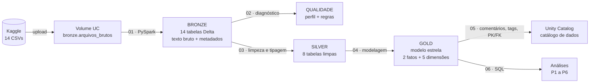

---

## 1. Contexto de Negócio e Perguntas (Etapa 2 e 4.1)

### 1.1 Problema

Um time de análise esportiva (por exemplo, de um veículo de mídia ou de uma plataforma de F1 Fantasy) precisa responder a uma dúvida recorrente dos fãs e comentaristas: **o que realmente decide uma corrida de Fórmula 1, e como isso mudou desde 1950?** A percepção comum é que "a corrida é decidida no sábado", que "hoje ninguém quebra" e que "a F1 ficou previsível". O objetivo deste MVP é construir a base de dados confiável que permite testar essas percepções com números, e não com impressões.

Para o Engenheiro de Dados, isso define decisões concretas: o grão do modelo precisa ser o **resultado de cada piloto em cada corrida**; é preciso ter a dimensão de tempo em **décadas e eras regulamentares**; as causas de abandono precisam ser **categorizadas**; e os pontos precisam ser **normalizados**, porque o sistema de pontuação mudou várias vezes.

### 1.2 Perguntas de negócio

| # | Pergunta | O que responde |
|---|---|---|
| **P1** | Largar na pole position garante a vitória? Com que frequência o vencedor sai da pole, e isso mudou ao longo das décadas? | Peso da classificação (sábado) |
| **P2** | O quanto a posição de largada explica a posição de chegada? Em quais circuitos da era atual mais se ganha ou perde posições? | Quanto a corrida "embaralha" o grid |
| **P3** | Os carros ficaram mais confiáveis? Como evoluíram os abandonos por falha mecânica e por acidente? | Peso da sorte/confiabilidade |
| **P4** | Os pit stops ficaram mais rápidos desde 2011? Quais equipes têm as paradas mais rápidas? | Peso da estratégia de box |
| **P5** | A F1 ficou mais ou menos previsível? Qual a concentração de vitórias da equipe dominante em cada temporada? | Peso do carro/equipe |
| **P6** | Existe "fator casa"? Pilotos rendem mais correndo no próprio país? | Peso de fatores emocionais/torcida |

As perguntas foram mantidas exatamente como definidas no início, mesmo as que não puderam ser respondidas por completo (ver [Autoavaliação](#7-autoavaliação)).

### 1.3 Fonte dos dados

| Item | Detalhe |
|---|---|
| Dataset | [Formula 1 World Championship (1950 – 2024)](https://www.kaggle.com/datasets/rohanrao/formula-1-world-championship-1950-2020), publicado por Rohan Rao no Kaggle |
| Origem primária | Dados compilados originalmente da antiga Ergast Developer API, conforme o crédito do publicador no Kaggle. A [Jolpica-F1](https://github.com/jolpica/jolpica-f1) mantém uma API sucessora compatível; ela não foi a fonte dos CSVs usados aqui. |
| Cobertura | Todas as corridas do Campeonato Mundial de 1950 a 2024 (1.125 corridas, 26.759 resultados) |
| Formato | 14 arquivos CSV, UTF-8, com `\N` como marcador de nulo |
| Coleta | CSVs versionados em `archive/` e enviados ao volume do Unity Catalog pela CLI oficial do Databricks |

**Licença e atribuição:** o [dataset utilizado](https://www.kaggle.com/datasets/rohanrao/formula-1-world-championship-1950-2020) declara no Kaggle a licença **CC0: Public Domain**. O publicador credita a antiga Ergast como origem dos dados. Este trabalho é acadêmico, sem fins comerciais, e registra essa origem aqui e na tag `fonte` de cada tabela.

### 1.4 Estrutura dos dados brutos

Os 14 arquivos formam um modelo relacional ligado por identificadores numéricos (`raceId`, `driverId`, `constructorId`, `circuitId`, `statusId`). Em **negrito**, os usados no modelo final; todos foram carregados na Bronze para preservar a rastreabilidade.

| Arquivo | Conteúdo | Colunas principais |
|---|---|---|
| **races** | Calendário: uma linha por GP | raceId, year, round, circuitId, name, date, time, horários de treinos (fp1–fp3), quali e sprint |
| **results** | Resultado de cada piloto em cada corrida | resultId, raceId, driverId, constructorId, grid, position, positionText, positionOrder, points, laps, milliseconds, fastestLapTime, fastestLapSpeed, statusId |
| **drivers** | Pilotos | driverId, driverRef, number, code, forename, surname, dob, nationality |
| **constructors** | Equipes | constructorId, constructorRef, name, nationality |
| **circuits** | Circuitos | circuitId, circuitRef, name, location, country, lat, lng, alt |
| **status** | Descrição do status final (~140 valores) | statusId, status |
| **pit_stops** | Paradas de box (desde 2011) | raceId, driverId, stop, lap, time, duration, milliseconds |
| qualifying | Tempos de classificação (Q1–Q3) | qualifyId, raceId, driverId, constructorId, position, q1, q2, q3 |
| lap_times | Tempo de cada volta (desde 1996) | raceId, driverId, lap, position, milliseconds |
| driver_standings | Classificação do campeonato de pilotos após cada GP | raceId, driverId, points, position, wins |
| constructor_standings | Classificação do campeonato de construtores após cada GP | raceId, constructorId, points, position, wins |
| constructor_results | Pontos por equipe em cada GP | raceId, constructorId, points, status |
| sprint_results | Resultados das corridas sprint (desde 2021) | mesmas colunas de results |
| seasons | Temporadas | year, url |

---

## 2. Carga dos Dados (Etapa 4.2)

A coleta seguiu o "caso simples" do enunciado: arquivos prontos, levados para a nuvem.

1. **Preparação do ambiente** ([`00_setup`](notebooks/00_setup.py)): cria o catálogo `f1_mvp` no Unity Catalog, os schemas `bronze`, `silver`, `gold` e `qualidade`, e o volume gerenciado `bronze.arquivos_brutos`. Se a conta não permitir criar catálogo, o código usa automaticamente o catálogo `workspace` do Free Edition.
2. **Arquivos de origem**: os 14 CSVs do dataset estão em [`archive/`](archive/) para tornar a execução reproduzível.
3. **Upload para a nuvem**: os 14 CSVs foram enviados pela CLI oficial do Databricks para `/Volumes/f1_mvp/bronze/arquivos_brutos/f1/`. A última célula do `00_setup` confere se todos os arquivos chegaram.
4. **Ingestão na Bronze** ([`01_bronze_ingestao`](notebooks/01_bronze_ingestao.py)): cada CSV vira uma tabela Delta com o mesmo nome, lida **sem inferência de tipos** (tudo como texto), para que a Bronze seja uma cópia fiel da fonte. São acrescentadas as colunas de controle `_arquivo_origem`, `_ingestao_ts` e `_fonte`.

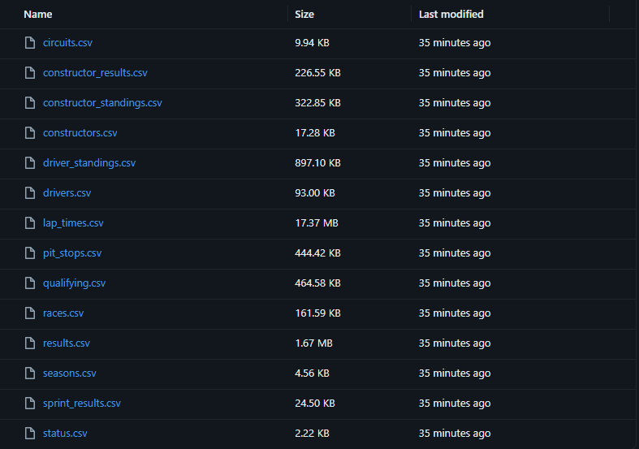

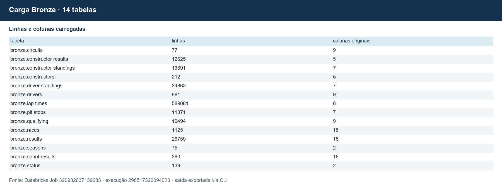

---

## 3. Modelagem e Catálogo de Dados (Etapa 4.3)

### 3.1 Modelo escolhido: Esquema Estrela

O problema tem um evento central bem definido (o **resultado de um piloto em uma corrida**) que é analisado por vários "ângulos" (quem, qual equipe, onde, quando, por que terminou). Esse é o caso clássico do **esquema estrela**. Um segundo fato, **pit stop**, compartilha as mesmas dimensões.

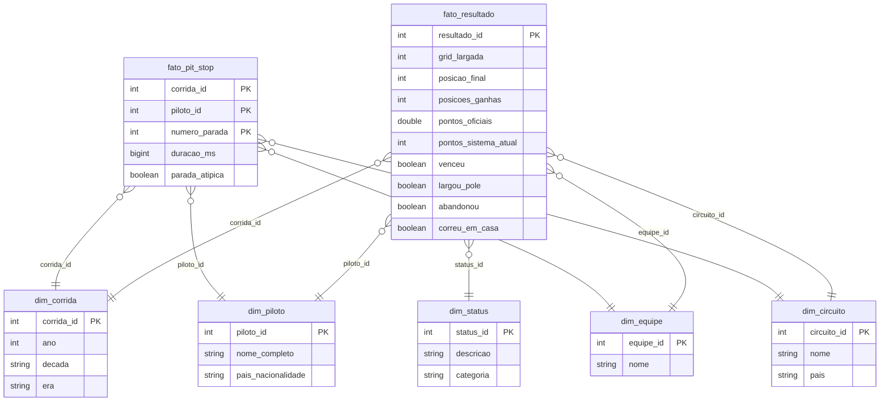

**Decisões de modelagem**

| Decisão | Motivo |
|---|---|
| Grão do fato = `resultado_id`, e não corrida + piloto | Nos anos 1950 era permitido dividir o carro: 85 pilotos têm mais de um resultado na mesma corrida (achado da etapa de qualidade) |
| `circuito_id` levado para os fatos | Evita que a análise por circuito passe por `dim_corrida` (o que seria snowflake). Custo de redundância irrelevante |
| `dim_corrida` também é a dimensão de tempo | Ano, década e era regulamentar resolvem todas as perguntas; uma `dim_tempo` diária não agregaria nada |
| Métricas derivadas no fato (`posicoes_ganhas`, `pontos_sistema_atual`, flags) | São usadas em várias perguntas; calcular uma vez na Gold garante a mesma regra em todas as consultas |
| `pontos_sistema_atual` | O sistema de pontos mudou mais de 10 vezes. Converter toda posição para a escala 25-18-15-...-1 permite comparar pilotos de eras diferentes |
| `categoria` em `dim_status` | Os ~140 status (motor, câmbio, "+2 Laps"...) foram agrupados em 8 categorias para medir confiabilidade |
| Paradas atípicas marcadas, não apagadas | Paradas longas são reais (bandeira vermelha); apagar perderia informação. A flag permite filtrar na análise |

### 3.2 Catálogo de Dados

O catálogo foi implementado **no próprio Unity Catalog** pelo notebook [`05_catalogo_dados`](notebooks/05_catalogo_dados.py), a partir de uma definição única em [`catalogo_def.py`](notebooks/catalogo_def.py). Para cada tabela são gravados: descrição da tabela; para cada coluna, descrição, tipo, **domínio esperado**, **domínio observado** (mínimo e máximo reais, calculados na execução) e **linhagem**; tags (`camada`, `tipo_tabela`, `fonte`); e chaves primárias e estrangeiras. O notebook também confere automaticamente se toda coluna existente está documentada e se o tipo documentado é o tipo real, e para com erro se não estiver. A linhagem entre tabelas é registrada automaticamente pelo Unity Catalog.

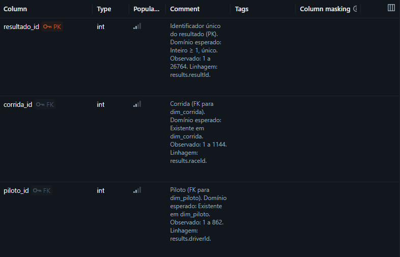

[Mais colunas documentadas: partes 2](docs/img/08_catalogo_fato_resultado_2.png), [3](docs/img/08_catalogo_fato_resultado_3.png), [4](docs/img/08_catalogo_fato_resultado_4.png), [5](docs/img/08_catalogo_fato_resultado_5.png), [6](docs/img/08_catalogo_fato_resultado_6.png) e [7](docs/img/08_catalogo_fato_resultado_7.png).

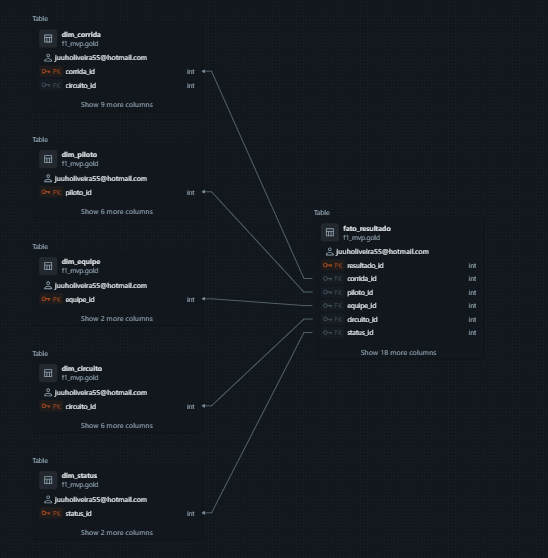

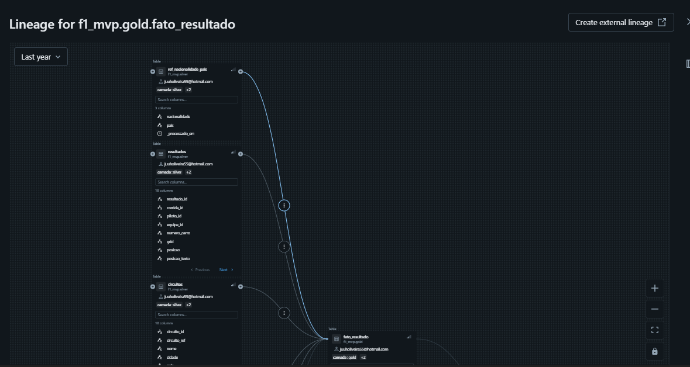

[Continuação do gráfico de linhagem: parte 2](docs/img/10_linhagem_2.png) e [parte 3](docs/img/10_linhagem_3.png).

**Transcrição do catálogo (camada Gold)**

<!-- CATALOGO:INICIO -->
#### `gold.fato_resultado`

Fato central do modelo. Uma linha por resultado de um piloto em uma corrida do Campeonato Mundial (1950 em diante). Nos anos 1950, um piloto pode ter mais de um resultado na mesma corrida (carro compartilhado).

**Chave primária:** `resultado_id` · **Chaves estrangeiras:** `corrida_id` → `gold.dim_corrida`, `piloto_id` → `gold.dim_piloto`, `equipe_id` → `gold.dim_equipe`, `circuito_id` → `gold.dim_circuito`, `status_id` → `gold.dim_status`

| Coluna | Tipo | Descrição | Domínio esperado | Linhagem (origem) |
|---|---|---|---|---|
| `resultado_id` | int | Identificador único do resultado (PK). | Inteiro ≥ 1, único | results.resultId |
| `corrida_id` | int | Corrida (FK para dim_corrida). | Existente em dim_corrida | results.raceId |
| `piloto_id` | int | Piloto (FK para dim_piloto). | Existente em dim_piloto | results.driverId |
| `equipe_id` | int | Equipe pela qual o piloto correu (FK para dim_equipe). | Existente em dim_equipe | results.constructorId |
| `circuito_id` | int | Circuito da corrida (FK para dim_circuito), trazido para o fato para evitar snowflake. | Existente em dim_circuito | races.circuitId via JOIN por raceId |
| `status_id` | int | Status final do piloto (FK para dim_status). | Existente em dim_status | results.statusId |
| `grid_largada` | int | Posição de largada. NULL quando largou do pit lane ou sem posição registrada. | 1 a 34; NULL | results.grid (0 → NULL) |
| `largou_sem_grid` | boolean | Grid não informado (grid = 0 e status indica largada); não comprova saída do pit lane. | true/false | Derivado de results.grid e da categoria do status |
| `posicao_final` | int | Posição de chegada oficial. NULL se não classificado. | 1 a 33; NULL | results.position (corrigida por positionText em 2 casos) |
| `posicao_ordem` | int | Ordem final incluindo não classificados (sempre preenchida). | 1 a 39 | results.positionOrder |
| `posicoes_ganhas` | int | grid_largada − posicao_final. Positivo = ganhou posições. | -30 a 30; NULL se não classificado | Derivado |
| `pontos_oficiais` | double | Pontos oficiais recebidos, conforme o regulamento da época. | 0 a 50 (GP de pontos dobrados de 2014) | results.points |
| `pontos_sistema_atual` | int | Pontos que o resultado valeria no sistema 25-18-15-12-10-8-6-4-2-1, para comparar eras. | 0,1,2,4,6,8,10,12,15,18,25 | Derivado de posicao_final |
| `voltas_completadas` | int | Voltas completadas pelo piloto. | 0 a 200 | results.laps |
| `tempo_total_ms` | bigint | Tempo total de prova em milissegundos (apenas para quem terminou na volta do líder). | > 0; NULL | results.milliseconds |
| `tempo_volta_rapida_ms` | bigint | Melhor volta do piloto em milissegundos (disponível a partir de 2004). | > 0; NULL | results.fastestLapTime convertido de M:SS.mmm |
| `venceu` | boolean | Verdadeiro se posicao_final = 1. | true/false | Derivado |
| `podio` | boolean | Verdadeiro se posicao_final ≤ 3. | true/false | Derivado |
| `largou_pole` | boolean | Verdadeiro se grid_largada = 1. | true/false | Derivado |
| `classificado` | boolean | Verdadeiro se o piloto recebeu posição oficial. | true/false | Derivado de results.position |
| `largou` | boolean | Verdadeiro se participou da corrida (status diferente de 'Não largou'). | true/false | Derivado de dim_status.categoria |
| `abandonou` | boolean | Verdadeiro se largou e terminou por Mecânica, Acidente/Incidente, Piloto/Segurança ou Abandono não especificado. | true/false | Derivado de dim_status.categoria |
| `correu_em_casa` | boolean | Verdadeiro se o país do circuito é o país da nacionalidade do piloto; NULL se o país não estiver mapeado. | true/false/NULL | Derivado: circuits.country × silver.ref_nacionalidade_pais |
| `idade_piloto_anos` | double | Idade do piloto na data da corrida, em anos (1 casa decimal). | 17 a 60 | Derivado: races.date − drivers.dob |

#### `gold.fato_pit_stop`

Uma linha por parada de box. Na versão do Kaggle, os registros começam na temporada 2011.

**Chave primária:** `corrida_id, piloto_id, numero_parada` · **Chaves estrangeiras:** `corrida_id` → `gold.dim_corrida`, `piloto_id` → `gold.dim_piloto`, `equipe_id` → `gold.dim_equipe`, `circuito_id` → `gold.dim_circuito`

| Coluna | Tipo | Descrição | Domínio esperado | Linhagem (origem) |
|---|---|---|---|---|
| `corrida_id` | int | Corrida (FK para dim_corrida). | Existente em dim_corrida | pit_stops.raceId |
| `piloto_id` | int | Piloto (FK para dim_piloto). | Existente em dim_piloto | pit_stops.driverId |
| `numero_parada` | int | Número sequencial da parada do piloto na corrida. | 1 a 8 | pit_stops.stop |
| `equipe_id` | int | Equipe do piloto naquela corrida (FK para dim_equipe). | Existente em dim_equipe | results.constructorId via JOIN por raceId + driverId |
| `circuito_id` | int | Circuito da corrida (FK para dim_circuito). | Existente em dim_circuito | races.circuitId via JOIN por raceId |
| `volta` | int | Volta em que a parada aconteceu. | 1 a 78 | pit_stops.lap |
| `duracao_ms` | bigint | Tempo total no pit lane (entrada à saída) em milissegundos. | ≈ 8 000 a 60 000 em paradas normais | pit_stops.milliseconds |
| `parada_atipica` | boolean | Verdadeiro se duracao_ms > 60 000 (bandeira vermelha, reparo, penalidade). Filtrar em médias. | true/false | Derivado de duracao_ms |

#### `gold.dim_corrida`

Uma linha por Grande Prêmio do calendário. Também cumpre o papel de dimensão de tempo (ano, década, era regulamentar).

**Chave primária:** `corrida_id` · **Chaves estrangeiras:** `circuito_id` → `gold.dim_circuito`

| Coluna | Tipo | Descrição | Domínio esperado | Linhagem (origem) |
|---|---|---|---|---|
| `corrida_id` | int | Identificador da corrida (PK). | Inteiro ≥ 1, único | races.raceId |
| `ano` | int | Temporada. | 1950 a ano atual | races.year |
| `rodada` | int | Número da etapa na temporada. | 1 a 24 | races.round |
| `nome_gp` | string | Nome oficial do Grande Prêmio (em inglês, como na fonte). | Ex.: 'Brazilian Grand Prix' | races.name |
| `data` | date | Data da corrida. | 1950-05-13 em diante | races.date |
| `circuito_id` | int | Circuito onde a corrida aconteceu (FK para dim_circuito). | Existente em dim_circuito | races.circuitId |
| `decada` | string | Década da temporada. | '1950s' a '2020s' | Derivado de ano |
| `era` | string | Agrupamento histórico simplificado por ano; não representa regras uniformes em toda a faixa. | 7 eras, de '1. Pioneira (1950-60)' a '7. Efeito solo (2022+)' | Derivado de ano |
| `tem_sprint` | boolean | Verdadeiro se o fim de semana teve corrida sprint. | true/false (sprints desde 2021) | Derivado de races.sprint_date |
| `eh_indy500` | boolean | Verdadeiro para as 500 Milhas de Indianápolis (contaram para o Mundial de 1950 a 1960). | true/false | Derivado de races.name |
| `possui_resultado` | boolean | Verdadeiro se há resultados carregados para a corrida (falso para corridas futuras). | true/false | Derivado: existência em results |

#### `gold.dim_piloto`

Uma linha por piloto que participou de ao menos uma inscrição no Mundial.

**Chave primária:** `piloto_id` · **Chaves estrangeiras:** —

| Coluna | Tipo | Descrição | Domínio esperado | Linhagem (origem) |
|---|---|---|---|---|
| `piloto_id` | int | Identificador do piloto (PK). | Inteiro ≥ 1, único | drivers.driverId |
| `nome_completo` | string | Nome e sobrenome. | Texto | drivers.forename + ' ' + drivers.surname |
| `codigo` | string | Código de três letras usado nas transmissões. | 3 letras maiúsculas; NULL para pilotos antigos | drivers.code |
| `numero_permanente` | int | Número permanente do carro (regra criada em 2014). | 1 a 99; NULL para pilotos antigos | drivers.number |
| `data_nascimento` | date | Data de nascimento. | 1896 a 2008 | drivers.dob |
| `nacionalidade` | string | Nacionalidade (em inglês, padronizada). | 42 valores, ex.: 'British', 'Brazilian' | drivers.nationality (trim + 'Argentinian'→'Argentine') |
| `pais_nacionalidade` | string | País correspondente à nacionalidade, na mesma grafia usada em dim_circuito.pais. | Ex.: 'UK', 'Brazil' | silver.ref_nacionalidade_pais |

#### `gold.dim_equipe`

Uma linha por equipe (construtor) da história da F1.

**Chave primária:** `equipe_id` · **Chaves estrangeiras:** —

| Coluna | Tipo | Descrição | Domínio esperado | Linhagem (origem) |
|---|---|---|---|---|
| `equipe_id` | int | Identificador da equipe (PK). | Inteiro ≥ 1, único | constructors.constructorId |
| `nome` | string | Nome da equipe. | Ex.: 'Ferrari', 'McLaren' | constructors.name |
| `nacionalidade` | string | Nacionalidade da equipe. | 24 valores, ex.: 'Italian', 'British' | constructors.nationality |

#### `gold.dim_circuito`

Uma linha por circuito que já recebeu corrida do Mundial.

**Chave primária:** `circuito_id` · **Chaves estrangeiras:** —

| Coluna | Tipo | Descrição | Domínio esperado | Linhagem (origem) |
|---|---|---|---|---|
| `circuito_id` | int | Identificador do circuito (PK). | Inteiro ≥ 1, único | circuits.circuitId |
| `nome` | string | Nome do circuito. | Texto | circuits.name |
| `cidade` | string | Cidade/localidade. | Texto | circuits.location |
| `pais` | string | País (padronizado: 'United States' → 'USA'). | ~35 países | circuits.country |
| `latitude` | double | Latitude em graus decimais. | -90 a 90 | circuits.lat |
| `longitude` | double | Longitude em graus decimais. | -180 a 180 | circuits.lng |
| `altitude_m` | int | Altitude em metros. | -10 a 2 300 | circuits.alt |

#### `gold.dim_status`

Uma linha por status final possível, com agrupamento em categorias de análise.

**Chave primária:** `status_id` · **Chaves estrangeiras:** —

| Coluna | Tipo | Descrição | Domínio esperado | Linhagem (origem) |
|---|---|---|---|---|
| `status_id` | int | Identificador do status (PK). | Inteiro ≥ 1, único | status.statusId |
| `descricao` | string | Descrição original do status. | ~140 valores, ex.: 'Engine', '+1 Lap' | status.status |
| `categoria` | string | Agrupamento para análise. | Finalizou, Mecânica, Acidente/Incidente, Desclassificado, Não largou, Não classificado, Piloto/Segurança, Abandono não especificado | Derivado por regra sobre status.status |

<details>
<summary><b>Catálogo das tabelas Silver (clique para expandir)</b></summary>

#### `silver.circuitos`

Circuitos limpos e tipados.

**Chave primária:** `circuito_id` · **Chaves estrangeiras:** —

| Coluna | Tipo | Descrição | Domínio esperado | Linhagem (origem) |
|---|---|---|---|---|
| `circuito_id` | int | Identificador do circuito. | Inteiro ≥ 1 | circuits.circuitId |
| `circuito_ref` | string | Chave textual do circuito na fonte. | Texto | circuits.circuitRef |
| `nome` | string | Nome do circuito. | Texto | circuits.name |
| `cidade` | string | Cidade. | Texto | circuits.location |
| `pais` | string | País padronizado. | ~35 valores | circuits.country |
| `latitude` | double | Latitude. | -90 a 90 | circuits.lat |
| `longitude` | double | Longitude. | -180 a 180 | circuits.lng |
| `altitude_m` | int | Altitude em metros. | -10 a 2 300 | circuits.alt |
| `url_wikipedia` | string | Página na Wikipédia. | URL | circuits.url |
| `_processado_em` | timestamp | Data/hora do processamento Silver. | Timestamp | Pipeline |

#### `silver.equipes`

Equipes (construtores) limpas e tipadas.

**Chave primária:** `equipe_id` · **Chaves estrangeiras:** —

| Coluna | Tipo | Descrição | Domínio esperado | Linhagem (origem) |
|---|---|---|---|---|
| `equipe_id` | int | Identificador da equipe. | Inteiro ≥ 1 | constructors.constructorId |
| `equipe_ref` | string | Chave textual da equipe na fonte. | Texto | constructors.constructorRef |
| `nome` | string | Nome da equipe. | Texto | constructors.name |
| `nacionalidade` | string | Nacionalidade da equipe. | 24 valores | constructors.nationality |
| `url_wikipedia` | string | Página na Wikipédia. | URL | constructors.url |
| `_processado_em` | timestamp | Data/hora do processamento Silver. | Timestamp | Pipeline |

#### `silver.pilotos`

Pilotos limpos, tipados e com nacionalidade padronizada.

**Chave primária:** `piloto_id` · **Chaves estrangeiras:** —

| Coluna | Tipo | Descrição | Domínio esperado | Linhagem (origem) |
|---|---|---|---|---|
| `piloto_id` | int | Identificador do piloto. | Inteiro ≥ 1 | drivers.driverId |
| `piloto_ref` | string | Chave textual do piloto na fonte. | Texto | drivers.driverRef |
| `numero_permanente` | int | Número permanente. | 1 a 99; NULL | drivers.number |
| `codigo` | string | Código de três letras. | 3 letras; NULL | drivers.code |
| `nome` | string | Primeiro nome. | Texto | drivers.forename |
| `sobrenome` | string | Sobrenome. | Texto | drivers.surname |
| `nome_completo` | string | Nome completo. | Texto | forename + surname |
| `data_nascimento` | date | Data de nascimento. | 1896 a 2008 | drivers.dob |
| `nacionalidade` | string | Nacionalidade padronizada. | 42 valores | drivers.nationality |
| `url_wikipedia` | string | Página na Wikipédia. | URL | drivers.url |
| `_processado_em` | timestamp | Data/hora do processamento Silver. | Timestamp | Pipeline |

#### `silver.corridas`

Calendário de corridas limpo e tipado.

**Chave primária:** `corrida_id` · **Chaves estrangeiras:** `circuito_id` → `silver.circuitos`

| Coluna | Tipo | Descrição | Domínio esperado | Linhagem (origem) |
|---|---|---|---|---|
| `corrida_id` | int | Identificador da corrida. | Inteiro ≥ 1 | races.raceId |
| `ano` | int | Temporada. | 1950 a ano atual | races.year |
| `rodada` | int | Etapa. | 1 a 24 | races.round |
| `circuito_id` | int | Circuito. | Existente em circuitos | races.circuitId |
| `nome_gp` | string | Nome do GP. | Texto | races.name |
| `data` | date | Data da corrida. | 1950 em diante | races.date |
| `hora_utc` | string | Horário de largada (UTC), HH:MM:SS. | NULL antes de 2005 | races.time |
| `data_sprint` | date | Data da sprint, se houver. | NULL antes de 2021 | races.sprint_date |
| `url_wikipedia` | string | Página na Wikipédia. | URL | races.url |
| `_processado_em` | timestamp | Data/hora do processamento Silver. | Timestamp | Pipeline |

#### `silver.status`

Status com categoria de análise.

**Chave primária:** `status_id` · **Chaves estrangeiras:** —

| Coluna | Tipo | Descrição | Domínio esperado | Linhagem (origem) |
|---|---|---|---|---|
| `status_id` | int | Identificador do status. | Inteiro ≥ 1 | status.statusId |
| `descricao` | string | Descrição original. | ~140 valores | status.status |
| `categoria` | string | Categoria de análise. | 8 categorias | Regra sobre status.status |
| `_processado_em` | timestamp | Data/hora do processamento Silver. | Timestamp | Pipeline |

#### `silver.resultados`

Resultados de corrida limpos e tipados, com tempos convertidos para milissegundos.

**Chave primária:** `resultado_id` · **Chaves estrangeiras:** `corrida_id` → `silver.corridas`, `piloto_id` → `silver.pilotos`, `equipe_id` → `silver.equipes`, `status_id` → `silver.status`

| Coluna | Tipo | Descrição | Domínio esperado | Linhagem (origem) |
|---|---|---|---|---|
| `resultado_id` | int | Identificador do resultado. | Inteiro ≥ 1 | results.resultId |
| `corrida_id` | int | Corrida. | Existente em corridas | results.raceId |
| `piloto_id` | int | Piloto. | Existente em pilotos | results.driverId |
| `equipe_id` | int | Equipe. | Existente em equipes | results.constructorId |
| `numero_carro` | string | Número do carro na corrida. | Texto numérico | results.number |
| `grid` | int | Posição de largada (0 = pit lane/sem posição). | 0 a 34 | results.grid |
| `posicao` | int | Posição final oficial. | 1 a 33; NULL | results.position / positionText |
| `posicao_texto` | string | Posição ou código (R=abandono, D=desclassificado, W=retirou-se, N=não classificado, F=não se classificou, E=excluído). | Número ou R/D/W/N/F/E | results.positionText |
| `posicao_ordem` | int | Ordem final incluindo não classificados. | 1 a 39 | results.positionOrder |
| `pontos` | double | Pontos oficiais. | 0 a 50 | results.points |
| `voltas` | int | Voltas completadas. | 0 a 200 | results.laps |
| `tempo_total_ms` | bigint | Tempo total de prova em ms. | > 0; NULL | results.milliseconds |
| `volta_mais_rapida` | int | Número da volta mais rápida do piloto. | ≥ 1; NULL | results.fastestLap |
| `rank_volta_rapida` | int | Ranking da volta mais rápida na corrida. | 0 a 24; NULL | results.rank |
| `tempo_volta_rapida_ms` | bigint | Tempo da melhor volta em ms. | > 0; NULL | results.fastestLapTime |
| `velocidade_volta_rapida_kmh` | double | Velocidade média da melhor volta (km/h). | ~90 a 260; NULL | results.fastestLapSpeed |
| `status_id` | int | Status final. | Existente em status | results.statusId |
| `_processado_em` | timestamp | Data/hora do processamento Silver. | Timestamp | Pipeline |

#### `silver.pit_stops`

Paradas de box com duração em milissegundos e marcação de paradas atípicas.

**Chave primária:** `corrida_id, piloto_id, numero_parada` · **Chaves estrangeiras:** `corrida_id` → `silver.corridas`, `piloto_id` → `silver.pilotos`

| Coluna | Tipo | Descrição | Domínio esperado | Linhagem (origem) |
|---|---|---|---|---|
| `corrida_id` | int | Corrida. | Existente em corridas | pit_stops.raceId |
| `piloto_id` | int | Piloto. | Existente em pilotos | pit_stops.driverId |
| `numero_parada` | int | Número da parada. | 1 a 8 | pit_stops.stop |
| `volta` | int | Volta da parada. | ≥ 1 | pit_stops.lap |
| `hora_local` | string | Horário local da parada (HH:MM:SS). | Texto | pit_stops.time |
| `duracao_ms` | bigint | Tempo no pit lane em ms. | > 0 | pit_stops.milliseconds (ou duration convertida) |
| `parada_atipica` | boolean | Duração acima de 60 s. | true/false | Derivado |
| `_processado_em` | timestamp | Data/hora do processamento Silver. | Timestamp | Pipeline |

#### `silver.ref_nacionalidade_pais`

Tabela de referência criada manualmente: nacionalidade do piloto → país na grafia de circuits.country.

**Chave primária:** `nacionalidade` · **Chaves estrangeiras:** —

| Coluna | Tipo | Descrição | Domínio esperado | Linhagem (origem) |
|---|---|---|---|---|
| `nacionalidade` | string | Nacionalidade como em silver.pilotos. | 42 valores | Curadoria manual |
| `pais` | string | País correspondente. | Grafia de circuits.country | Curadoria manual |
| `_processado_em` | timestamp | Data/hora do processamento Silver. | Timestamp | Pipeline |

</details>

<!-- CATALOGO:FIM -->

---

## 4. Pipeline de Dados (Etapa 4.4)

### 4.1 Organização

O pipeline foi **ramificado em um notebook por etapa**, seguindo a Arquitetura Medalhão. Cada notebook lê de uma camada e grava na seguinte, pode ser reexecutado quantas vezes for preciso (as tabelas são sobrescritas) e termina com validações que interrompem o fluxo se algo sair errado. O código compartilhado (nomes, caminhos, função de gravação) fica em [`config.py`](notebooks/config.py).

| Notebook | Etapa | Lê de | Grava em | Linguagem |
|---|---|---|---|---|
| [`00_setup`](notebooks/00_setup.py) | Ambiente | — | catálogo, schemas, volume | PySpark/SQL |
| [`01_bronze_ingestao`](notebooks/01_bronze_ingestao.py) | Extract + Load | volume (CSV) | `bronze.*` (14 tabelas) | PySpark |
| [`02_qualidade_diagnostico`](notebooks/02_qualidade_diagnostico.py) | Qualidade | `bronze.*` | `qualidade.perfil_bronze`, `qualidade.regras_bronze` | PySpark |
| [`03_silver_transformacao`](notebooks/03_silver_transformacao.py) | Transform | `bronze.*` | `silver.*` (8 tabelas), `qualidade.validacao_silver` | PySpark |
| [`04_gold_modelagem`](notebooks/04_gold_modelagem.py) | Transform + Load | `silver.*` | `gold.*` (7 tabelas) | PySpark |
| [`05_catalogo_dados`](notebooks/05_catalogo_dados.py) | Catálogo | `gold.*`, `silver.*` | comentários, tags e PK/FK no Unity Catalog | PySpark/SQL |
| [`06_analise`](notebooks/06_analise.py) | Análise | `gold.*` | — (consultas e gráficos) | SQL + matplotlib |
| [`99_executar_pipeline`](notebooks/99_executar_pipeline.py) | Orquestração | — | roda 01 a 06 em sequência | PySpark |

### 4.2 Transformações realizadas

**Bronze → Silver** (tratamentos T1 a T10, justificados na seção 5):

- `\N` e textos vazios convertidos em `NULL`; `trim` em todos os textos.
- Tipagem explícita com `try_cast` (inteiros, decimais, datas), que devolve `NULL` em vez de derrubar o job diante de um valor inválido.
- Renomeação das colunas para `snake_case` em português (`driverId` → `piloto_id`).
- Padronização de grafias: `United States` → `USA`; `Argentinian ` → `Argentine`.
- Correção de 2 resultados com `position` nula e `positionText` numérico.
- Tempos de volta `M:SS.mmm` convertidos em milissegundos.
- Criação da categoria de status e da tabela de referência nacionalidade → país.
- Deduplicação pela chave primária e coluna de auditoria `_processado_em`.

**Silver → Gold**:

- **JOIN** de `resultados` com `corridas` (pela `corrida_id`) para trazer circuito e data, com `circuitos` para o país do circuito, com `pilotos` + `ref_nacionalidade_pais` para o país do piloto e com `status` para a categoria. Com isso são calculadas as flags `correu_em_casa`, `largou`, `abandonou` e a idade do piloto.
- Derivação de `grid_largada` (grid 0 → `NULL`), `posicoes_ganhas`, `pontos_sistema_atual`, `venceu`, `podio`, `largou_pole` e `classificado`.
- **JOIN** de `pit_stops` com `resultados` (por corrida + piloto) para identificar a equipe de cada parada.
- Validações: o fato tem o mesmo número de linhas da Silver (nenhum JOIN duplicou ou perdeu registros), `resultado_id` é único, toda corrida tem vencedor e toda parada tem equipe.

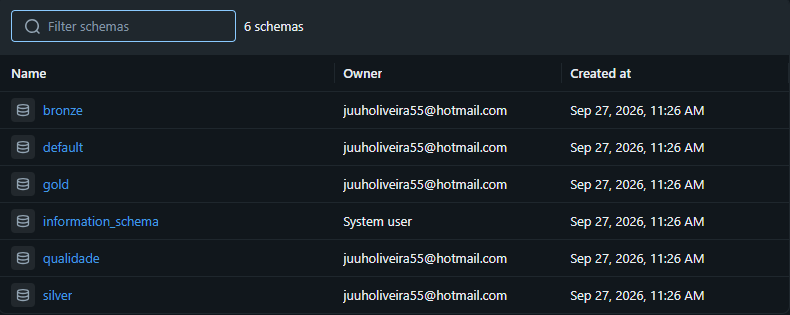

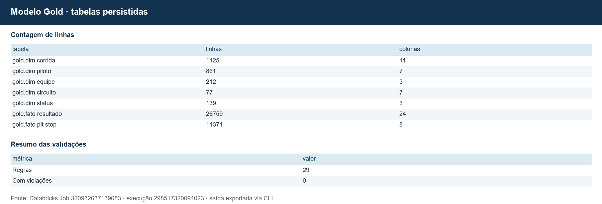

---

## 5. Qualidade de Dados (Etapa 4.5)

A qualidade foi verificada **antes** da transformação (diagnóstico da Bronze, notebook 02) e **depois** dela (validações da Silver e da Gold, notebooks 03 e 04). Os resultados ficam gravados em tabelas do schema `qualidade`, o que permite acompanhar a qualidade a cada nova carga.

**Completude.** O perfil de todas as colunas das 14 tabelas (`qualidade.perfil_bronze`) mostrou que os nulos se concentram onde são esperados por natureza histórica, e não por erro: horários de treinos só existem desde 2021 (92–99% nulos), o código de três letras e o número permanente dos pilotos só existem para pilotos recentes (88% e 93% nulos), a volta mais rápida só é registrada desde 2004 (69% nulos) e o tempo total só existe para quem terminou na volta do líder (71% nulos). A `position` nula (41%) corresponde aos pilotos não classificados. Nenhuma chave ou coluna essencial tem nulos.

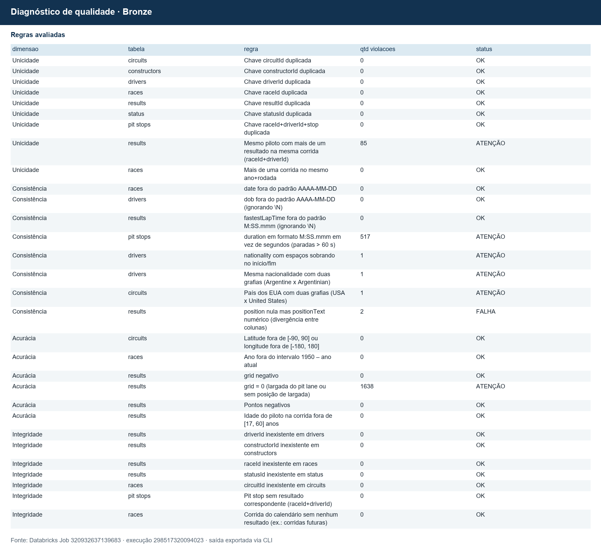

| # | Dimensão | Problema detectado | Ocorrências | Tratamento |
|---|---|---|---|---|
| 1 | Completude | Nulos gravados como o texto `\N` | todas as tabelas | T1: convertidos em `NULL` real |
| 2 | Consistência | Todas as colunas como texto | todas as tabelas | T2: tipagem com `try_cast` |
| 3 | Consistência | País dos EUA com duas grafias (`USA` e `United States`) | 1 circuito | T4: padronizado para `USA` (necessário para o fator casa) |
| 4 | Consistência | Nacionalidade `Argentinian ` (com espaço) além de `Argentine` | 1 piloto | T1 + T4: `trim` e grafia única |
| 5 | Consistência | `position` nula com `positionText` numérico | 2 resultados | T5: `position` recebe `positionText` |
| 6 | Consistência | Duração do pit stop em dois formatos (`SS.mmm` e `M:SS.mmm`) | 517 paradas | Uso da coluna numérica `milliseconds` |
| 7 | Consistência | Nacionalidade do piloto (`British`) e país do circuito (`UK`) em vocabulários diferentes | 42 nacionalidades | T9: tabela `ref_nacionalidade_pais` |
| 8 | Unicidade | Mesmo piloto com mais de um resultado na mesma corrida | 85 casos (anos 1950) | **Não é erro** (carro compartilhado). Definiu o grão do fato como `resultado_id` |
| 9 | Acurácia | `grid = 0` | 1.638 resultados | Não é posição válida: largada do pit lane ou sem registro. Vira `NULL` e flag `largou_sem_grid`; não comprova saída do pit lane |
| 10 | Acurácia | Faixas: latitude/longitude, ano, pontos, grid negativo, idade do piloto (17–60 anos) | 0 | Nenhum tratamento necessário (verificação registrada) |
| 11 | Integridade | Chaves estrangeiras órfãs (piloto, equipe, corrida, status, circuito, pit stop sem resultado) | 0 | Nenhum tratamento necessário |
| 12 | Unicidade | Chaves primárias duplicadas nas 7 tabelas usadas | 0 | Deduplicação mantida como proteção para cargas futuras |
| 13 | Outliers | Pit stops de minutos (máximo de 51 min) | 517 acima de 60 s | T7: flag `parada_atipica`; análises usam mediana e excluem atípicas |
| 14 | Contexto | Indianápolis 500 (1950–60) contava para o Mundial com pilotos e equipes próprios | 11 corridas | Flag `eh_indy500`; excluídas das análises |

**O outlier dos pit stops em números:** a média das 11.371 paradas é de **85,2 s**, mas a mediana é de **23,6 s**. As 460 paradas acima de 10 minutos (paralisações com bandeira vermelha) puxam a média para mais que o triplo do valor típico. É um exemplo concreto de por que usar mediana e filtrar outliers antes de responder P4.

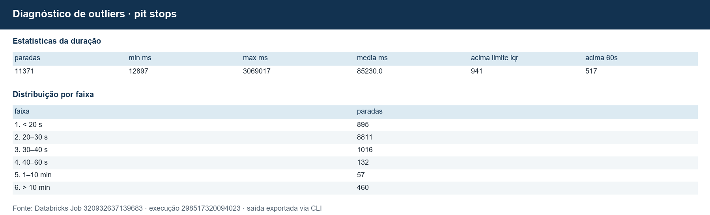

Depois da transformação, 11 validações (`qualidade.validacao_silver`) confirmam que os problemas foram de fato resolvidos (nenhum `\N` restante, grafias únicas, chaves não nulas, todas as nacionalidades mapeadas etc.). Se qualquer uma falhar, o notebook interrompe a execução com `assert`, impedindo que dados inconsistentes cheguem à Gold.

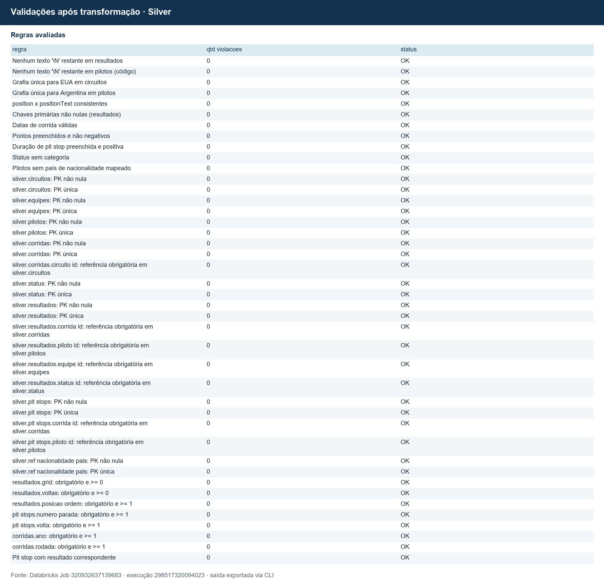

---

## 6. Análise de Dados (Etapa 4.5)

Todas as consultas estão em [`06_analise`](notebooks/06_analise.py). Recorte: temporadas 1950–2024, sem a Indianápolis 500 (26.354 resultados).

### P1 · Largar na pole garante a vitória?

| Década | Corridas | % das vitórias saindo da pole | % saindo do top 3 | Grid médio do vencedor |
|---|---|---|---|---|
| 1950s | 74 | 44,6% | 87,8% | 2,30 |
| 1960s | 99 | 37,4% | 70,7% | 2,99 |
| 1970s | 144 | 36,8% | 71,5% | 3,16 |
| 1980s | 156 | **28,2%** | 61,5% | 3,44 |
| 1990s | 162 | 42,6% | 84,0% | 2,47 |
| 2000s | 174 | 50,0% | 82,2% | 2,47 |
| 2010s | 198 | 50,5% | **90,4%** | 2,02 |
| 2020s | 107 | **52,3%** | 82,2% | 2,51 |

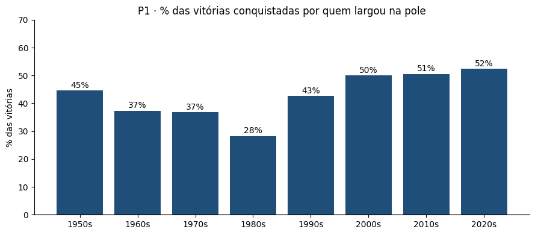

**Resposta:** não garante, mas é de longe a melhor posição. No histórico, quem larga na pole vence **43,0%** das vezes e sobe ao pódio em 64,2%; do 2º lugar, a taxa de vitória cai quase pela metade (24,0%) e do 10º é de apenas 1,1%. O dado mais interessante é a tendência: o peso da pole caiu até os anos 1980 (28%, a década dos motores turbo, quando os carros quebravam muito e a ordem da corrida se embaralhava) e depois subiu continuamente. Desde os anos 2000, **metade das corridas é vencida por quem larga na frente** e, nos anos 2010, 9 em cada 10 vencedores saíram das três primeiras posições do grid. Na F1 moderna, a frase "a corrida é decidida no sábado" tem base nos dados.

### P2 · O quanto a largada explica a chegada?

| Era | Correlação largada × chegada | Posições trocadas por piloto (média) | % que terminou onde largou |
|---|---|---|---|
| Pioneira (1950–60) | 0,700 | 4,72 | 10,3% |
| Motor traseiro e aerodinâmica (1961–82) | **0,623** | 5,51 | 8,0% |
| Turbo e eletrônica (1983–94) | 0,662 | **5,96** | 9,3% |
| V10 e guerra de pneus (1995–2005) | 0,700 | 4,03 | 11,7% |
| V8 (2006–13) | **0,758** | 3,35 | 13,1% |
| Híbrida (2014–21) | 0,754 | 2,97 | **17,3%** |
| Efeito solo (2022+) | 0,727 | 2,91 | 15,3% |

Circuitos de 2014–2024 com pelo menos 5 corridas, dos que mais aos que menos trocam posições (extremos):

| Circuito | Corridas | Posições trocadas (média) | Correlação | % vitórias da pole |
|---|---|---|---|---|
| Baku (Azerbaijão) | 8 | **3,40** | 0,682 | 25% |
| Sochi (Rússia) | 8 | 3,33 | 0,673 | 25% |
| Hungaroring (Hungria) | 11 | 3,27 | 0,709 | 27% |
| Interlagos (Brasil) | 10 | 3,23 | 0,679 | 70% |
| … | | | | |
| Yas Marina (Abu Dhabi) | 11 | 2,57 | 0,754 | **91%** |
| Barcelona (Espanha) | 11 | 2,47 | 0,825 | 64% |
| Mônaco | 10 | **2,33** | **0,848** | 50% |

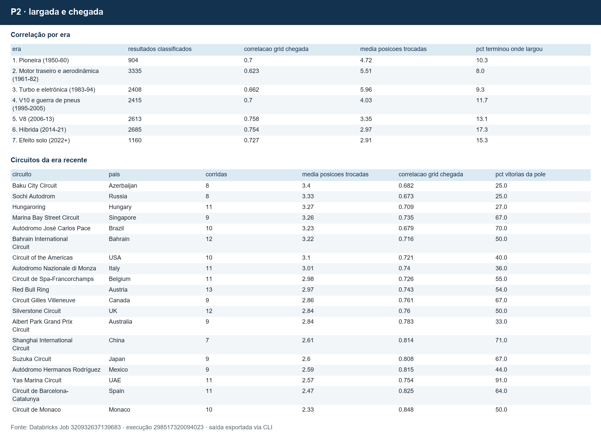

**Resposta:** a posição de largada explica cada vez mais o resultado. A correlação subiu de 0,62 (1961–82) para cerca de 0,75 nas eras V8 e híbrida, e a movimentação média caiu pela metade, de quase 6 posições por piloto na era turbo para menos de 3 hoje. A proporção de pilotos que terminam exatamente onde largaram dobrou (de 8% para 17%). A leve queda para 0,727 na era do efeito solo (2022+) é coerente com o objetivo declarado do regulamento de 2022, que era facilitar ultrapassagens, mas o efeito é pequeno. Entre os circuitos, **Mônaco e Barcelona** são os mais "engessados", enquanto **Baku e Hungaroring** são os mais imprevisíveis: nesses dois, a pole venceu apenas 1 em cada 4 corridas. Um contraponto interessante: em Interlagos se trocam muitas posições, mas a pole venceu 70% das vezes; ou seja, a movimentação acontece mais no pelotão do que na briga pela vitória.

### P3 · Os carros ficaram mais confiáveis?

| Década | Largadas | % terminou | % abandono mecânico | % abandono por acidente |
|---|---|---|---|---|
| 1950s | 1.559 | 51,5% | 39,5% | 6,9% |
| 1960s | 1.881 | 50,1% | **40,2%** | 6,9% |
| 1970s | 3.440 | 51,8% | 32,6% | 12,5% |
| 1980s | 3.938 | **44,1%** | 39,5% | 13,3% |
| 1990s | 3.883 | 50,3% | 30,6% | **17,7%** |
| 2000s | 3.624 | 68,2% | 19,0% | 11,7% |
| 2010s | 4.283 | 80,6% | 10,5% | 7,5% |
| 2020s | 2.133 | **85,7%** | **6,3%** | 6,8% |

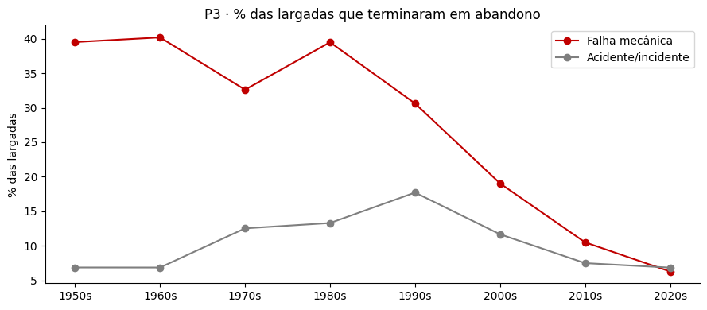

**Resposta:** sim, e de forma dramática. Até os anos 1990, **metade do grid não terminava a corrida** e cerca de 1 em cada 3 largadas acabava em quebra. A virada acontece nos anos 2000 e se consolida nos 2010, com limites de motores e câmbios por temporada que obrigaram as equipes a projetar para durar. Nos anos 2020, 86% dos pilotos terminam e a falha mecânica caiu para 6,3%, **abaixo dos acidentes pela primeira vez na história**. Isso conecta P3 a P1 e P2: com menos quebras, quem larga na frente raramente é tirado da disputa por azar, e a ordem do grid se preserva. A década de 1980, com a menor taxa de conclusão (44%), é justamente a de menor peso da pole em P1.

### P4 · Os pit stops ficaram mais rápidos?

Anos selecionados (a série completa está no notebook):

| Ano | Paradas | Mediana no pit lane (s) | 10% mais rápidas (s) |
|---|---|---|---|
| 2011 | 1.113 | 22,37 | 20,50 |
| 2012 | 946 | **22,25** | 19,75 |
| 2014 | 791 | 24,22 | 21,75 |
| 2017 | 675 | 23,58 | **17,74** |
| 2020 | 532 | 24,16 | 21,68 |
| 2024 | 770 | 23,29 | 21,07 |

Equipes de 2022–2024 (com ao menos 50 paradas), pelo tempo relativo à mediana de cada corrida (abaixo de 1 = mais rápida que a média):

| Equipe | Paradas | Tempo relativo mediano |
|---|---|---|
| Red Bull | 251 | **0,982** |
| Ferrari | 217 | 0,989 |
| AlphaTauri | 165 | 0,989 |
| McLaren | 237 | 0,992 |
| Mercedes | 234 | 0,993 |
| … | | |
| Haas F1 Team | 243 | **1,023** |

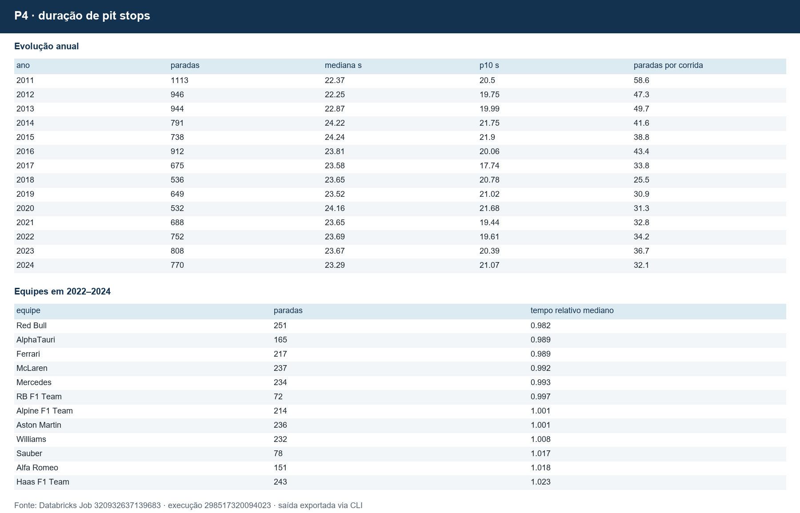

**Resposta (parcial):** pelo que os dados medem, **não**. A mediana ficou praticamente estável, em torno de 22–24 s, e até subiu um pouco a partir de 2014. A explicação está na própria métrica: a fonte registra o **tempo total no pit lane**, e não o tempo com o carro parado. A troca de pneus em si caiu para cerca de 2 segundos nesse período, mas esse ganho de 1–2 s fica escondido dentro de um tempo dominado pelo limite de velocidade e pelo comprimento da via dos boxes, que variam por circuito e por regulamento. A comparação entre equipes, usando o tempo relativo à mediana de cada corrida para neutralizar o efeito do circuito, é mais reveladora: a **Red Bull** foi a mais rápida de 2022 a 2024 (1,8% abaixo da mediana, cerca de 0,4 s por parada), enquanto a **Haas** foi a mais lenta (2,3% acima). O ranking é coerente com o que se sabe do esporte, mas a diferença entre a melhor e a pior equipe é de cerca de 1 s por parada.

### P5 · A F1 ficou mais ou menos previsível?

| Década | % média das vitórias da equipe dominante | Pilotos vencedores diferentes por temporada |
|---|---|---|
| 1950s | 72,9% | 3,6 |
| 1960s | 51,1% | 4,8 |
| 1970s | **42,5%** | **6,7** |
| 1980s | 50,3% | 6,5 |
| 1990s | 54,9% | 4,9 |
| 2000s | 58,0% | 5,3 |
| 2010s | 65,7% | 4,8 |
| 2020s | **67,4%** | 5,2 |

Temporadas mais dominadas: Alfa Romeo 1950 e Ferrari 1952 (100%), **Red Bull 2023 (21 de 22 corridas, 95,5%)**, McLaren 1988 (93,8%), Mercedes 2016 (90,5%), Ferrari 2002 (88,2%).

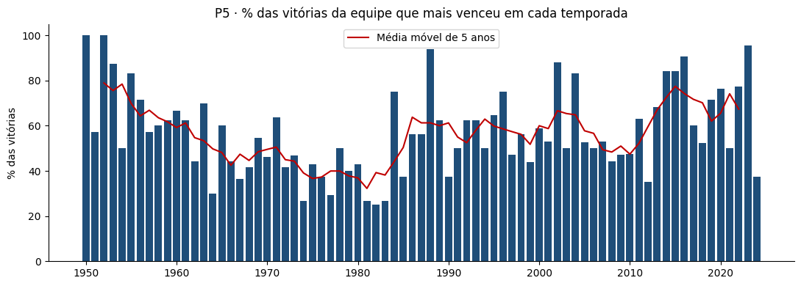

**Resposta:** ficou **mais previsível**. Os anos 1970 foram a década mais equilibrada (a equipe dominante vencia 42% das corridas e quase 7 pilotos diferentes venciam por temporada). Desde então, a concentração cresce de forma quase contínua, e nos anos 2020 a melhor equipe vence dois terços das corridas. A série anual mostra ciclos: cada grande mudança de regulamento abre uma janela de dominância (Mercedes 2014–2016, Red Bull 2022–2023), que depois se fecha à medida que as outras equipes alcançam, como em 2024 (37,5%). Somando P1, P2, P3 e P5, a resposta ao problema central fica clara: **na F1 moderna, o resultado é decidido principalmente pelo carro**, que define a classificação, que define a largada, que quase sempre define a chegada, porque os carros praticamente não quebram mais.

### P6 · Existe fator casa?

Comparação pareada (cada piloto contra ele mesmo), 1980–2024, 97 pilotos com ao menos 3 largadas em casa e 20 fora:

| Métrica | Em casa | Fora |
|---|---|---|
| Pontos médios por corrida (sistema atual) | 4,15 | 3,87 |
| Taxa de abandono | 41,6% | 40,4% |
| Pilotos que pontuam mais em casa | 49,5% | — |
| Diferença média pareada | **+0,28 ponto** (t = 1,16) | |

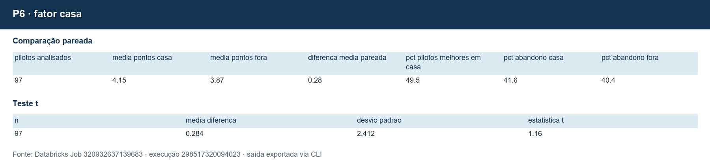

**Resposta:** **não há evidência de fator casa** no conjunto dos pilotos. A diferença média é pequena (+0,28 ponto por corrida), apenas metade dos pilotos rende mais em casa (49,5%, praticamente cara ou coroa) e a estatística t de 1,16 está bem abaixo do nível usual de significância (cerca de 2). Há, no entanto, casos individuais marcantes: Nigel Mansell (+6,96 pontos por corrida no GP da Inglaterra, em Silverstone e Brands Hatch), Alain Prost (+6,47) e Lewis Hamilton (+4,27) renderam muito mais em casa. Do lado oposto aparecem dois brasileiros: Ayrton Senna (−4,44) e Rubens Barrichello (−3,66) foram, em média, piores no GP do Brasil (Jacarepaguá e Interlagos), o que é coerente com a fama de quebras e azares dos brasileiros no GP do Brasil, enquanto Felipe Massa (+2,74) foi a exceção. Com amostras de 10 a 20 corridas em casa por piloto, esses casos podem ser acaso, e não é possível afirmar causalidade.

### Discussão geral

As seis respostas se encaixam em uma narrativa única. Nos primeiros 40 anos da F1, **a confiabilidade** era o grande embaralhador: metade dos carros quebrava, a pole valia menos e as posições mudavam muito. Com a evolução técnica e as regras de durabilidade, as quebras quase desapareceram (P3), o grid passou a se preservar (P2), a pole voltou a valer metade das vitórias (P1) e a equipe com o melhor carro passou a vencer dois terços das corridas (P5). Os fatores que a torcida costuma apontar como decisivos, como o pit stop (P4) e correr em casa (P6), têm efeito real, mas pequeno perto do carro: décimos de segundo por parada e nenhum efeito sistemático de "casa". Para o time de análise do nosso contexto, a recomendação prática é que previsões de resultado usem a posição de largada e a força da equipe na temporada como variáveis principais, e tratem pit stop e fator casa como ajustes finos.

---

## 7. Autoavaliação

**Objetivos atingidos.** O pipeline completo foi construído e funciona de ponta a ponta na nuvem: ingestão de 14 arquivos, diagnóstico de qualidade, limpeza, modelo estrela, catálogo no Unity Catalog e análises. Das seis perguntas, **quatro foram respondidas por completo** (P1, P2, P3 e P5) e **duas parcialmente**:

- **P4 (pit stops):** a pergunta original era se as paradas ficaram mais rápidas. O dado disponível mede o tempo total no pit lane, e não o tempo parado, então não foi possível medir a evolução da troca de pneus em si. A comparação relativa entre equipes contornou parte do problema. Esse limite só ficou claro durante a análise, o que reforça a lição de verificar o **significado** de cada campo, e não só o formato.
- **P6 (fator casa):** foi respondida no agregado (não há efeito), mas não foi possível isolar a causa dos casos individuais. Além disso, "casa" foi definido pela nacionalidade do piloto, sem considerar pilotos que moram em outro país ou GPs "caseiros" das equipes.

**Dificuldades.** As principais foram entender o domínio: descobrir que um piloto podia ter dois resultados na mesma corrida (carros compartilhados) mudou o grão do modelo, e perceber que `grid = 0` não é uma posição e que a Indianápolis 500 contava para o Mundial evitou conclusões erradas em P1 e P2. Tecnicamente, o modo ANSI do Spark rejeita conversões de valores como `\N`, o que exigiu o uso de `try_cast`; e manter o catálogo sincronizado com as tabelas levou à decisão de definir a documentação em um só arquivo e validá-la automaticamente.

**Limitações conhecidas.** O status `Retired` (sem causa informada) aparece sobretudo a partir dos anos 2010 (cerca de 1% das largadas) e pode subestimar levemente a taxa de falha mecânica recente. A categorização de status foi feita por regra manual, e alguns casos são ambíguos (um furo pode ser falha ou incidente). O `pontos_sistema_atual` não inclui pontos de sprint nem de volta mais rápida.

**Trabalhos futuros.**

1. **Ingestão incremental via API**: substituir o upload manual pela [API Jolpica](https://github.com/jolpica/jolpica-f1) (sucessora da Ergast), com carga incremental a cada GP, `MERGE` na Silver e um Job agendado no Databricks.
2. **Tempo parado nos pit stops**: integrar dados de telemetria (por exemplo, a biblioteca FastF1) para responder P4 por completo.
3. **Novos fatos**: `fato_volta` (lap_times) e `fato_classificacao` (qualifying) para analisar ritmo de corrida e diferença entre classificação e corrida.
4. **Modelo preditivo**: usar a Gold como base de features para prever pódio a partir de grid, equipe e circuito.
5. **Dashboard**: publicar as análises em um AI/BI Dashboard do Databricks.

---

## 8. Como reproduzir

1. Crie uma conta no [Databricks Free Edition](https://www.databricks.com/learn/free-edition).
2. Importe a pasta `notebooks/` para o workspace (ou conecte este repositório como Git folder).
3. Rode `notebooks/00_setup` para criar catálogo, schemas e volume.
4. Envie os 14 arquivos de `archive/` para `/Volumes/f1_mvp/bronze/arquivos_brutos/f1/`. Pela CLI oficial: `databricks fs cp -r archive dbfs:/Volumes/f1_mvp/bronze/arquivos_brutos/f1 --overwrite`.
5. Crie um Job serverless com sete tarefas, uma por notebook de `00_setup` a `06_analise`, com dependência da anterior, e execute. O notebook `99_executar_pipeline` também permite execução interativa em sequência.

### Execução verificada no Databricks

O [Job **MVP F1 - Pipeline 1950-2024**](https://dbc-b1517781-77f5.cloud.databricks.com/?o=7474658536302591#job/320932637139683/run/298517320094023) terminou com **sucesso** após correção e reparo da tarefa de análise. As sete etapas (`00` a `06`) passaram; foram carregadas 14 tabelas Bronze, 8 Silver e 7 Gold. Os resultados de tabelas estão em [`docs/evidencias_job.json`](docs/evidencias_job.json). As imagens em `docs/img/` identificadas como saídas do Job foram extraídas ou geradas a partir desses resultados. O acesso ao Job exige permissão neste workspace.

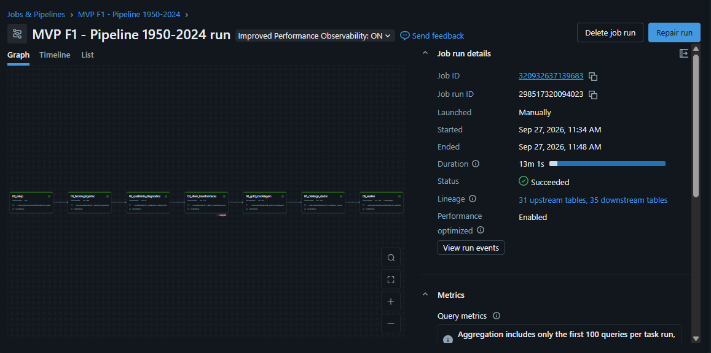

As capturas reais do Catalog Explorer mostram os schemas, o volume, os comentários das colunas, o diagrama de PK/FK e a linhagem. Todas estão em [`docs/img/`](docs/img/).

### Estrutura do repositório

```
├── README.md                       ← este documento
├── notebooks/
│   ├── config.py                   ← configurações e funções compartilhadas
│   ├── catalogo_def.py             ← definição única do catálogo de dados
│   ├── 00_setup.py                 ← catálogo, schemas e volume
│   ├── 01_bronze_ingestao.py       ← CSV → Bronze
│   ├── 02_qualidade_diagnostico.py ← perfil e regras de qualidade
│   ├── 03_silver_transformacao.py  ← Bronze → Silver
│   ├── 04_gold_modelagem.py        ← Silver → Gold (modelo estrela)
│   ├── 05_catalogo_dados.py        ← comentários, tags e PK/FK no Unity Catalog
│   ├── 06_analise.py               ← respostas às perguntas P1–P6
│   └── 99_executar_pipeline.py     ← execução interativa alternativa
├── archive/                        ← 14 CSVs de origem
└── docs/
    ├── gerar_catalogo_md.py        ← gera a transcrição do catálogo neste README
    ├── evidencias_job.json         ← resultados exportados do Job
    ├── gerar_evidencias.py         ← gera imagens das tabelas exportadas
    └── img/                        ← figuras e saídas reais do Job
```
